# 分布式系统实验报告

## Lab1 Paxos算法

### 实验目的

考察学生对于Paxos算法的学习和理解，加深对分布式一致性协议的理解。

### 实验内容

根据Paxos算法流程完成相关核心成员函数设计。

需要了解的基本概念：

- 角色

  - 提议者(proposer): 进行提议的角色；
  - 批准者(acceptor): 通过提议的角色；
  - 学习者(learner): 感知被选中的提议。

  在具体的实现中，一个进程可能同时充当多种角色。比如一个进程可能既是 Proposer 又是 Acceptor 又是 Learner。

- 提案（propose）

  - Proposer可以提出提案，最终要达成一致的value就在提案里

  - Acceptor根据提案的编号来选择是否接受（accept）提案

  - 如果超过半数的Acceptor接收了一个提案，那么这个提案就被接受（accepted）了，提案里的 value 也就被选定了

- 在何种情况下不同的进程认为提案被选定了？

  - Proposer ：只要 Proposer 发的提案被 Acceptor 接受， Proposer 就认为该提案里的 value 被选定了。

  - Acceptor ：只要 Acceptor 接受了某个提案，Acceptor 就认为该提案里的value 被选定了。 

  - Learner：Acceptor 告诉 Learner 哪个 value 被选定，Learner 就认为那个 value 被选定。

- 最终如何达成一致： 一个提案被接受后，如果还有Proposer在继续提出提案，会修改提案的value为已被接受的value，然后继续下一轮提案

Paxos算法更详细的流程和思想需要学生自行查阅资料学习

### 实验方法

- Paxos实验的源码都在src/文件夹下
  - Paxos.cpp main程序入口，代码测试主逻辑
  - lib/ 用到的库文件
  - Paxos/ Acceptor和Proposer类和相关数据结构实现代码

- 测试代码中，会开启5个Proposer，11个Acceptor进⾏Paxos算法流程

  - 每个Proposer独立线程，Acceptor不需要线程

  - Proposer编号从0-5，编号为i的Proposer初始提议编号和提议值是（i+1, i+1）

  - Proposer每次重新提议会将提议编号增加5

  - Proposer被批准后结束线程，其它线程继续投票

  - 最终，全部批准相同的值，达成⼀致

- Paxos算法的过程类似于两阶段提交，执行过程分为两个阶段：

  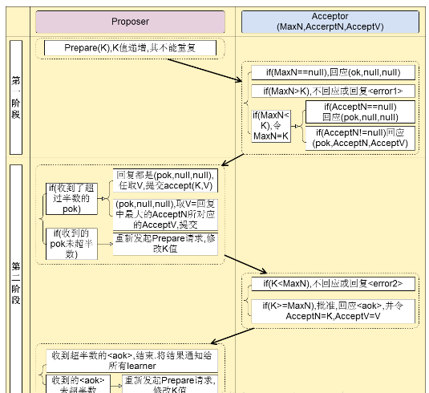

  - 阶段一：Propose阶段：
    - Proposer选择一个提案编号N，然后向半数以上的Acceptor发送编号为N的Propose请求，记为为Propose(N)请求。
    
    - 当一个Acceptor收到一个Propose(N)请求，如果N小于它已经响应过的任何一个请求(maxN)，则拒绝；如果N大于它已经响应过的所有Propose请求的编号，那么它就会将它已经接受过（即已经通过第二阶段accept的提案）的编号最大的提案lastAcceptPropose作为响应反馈给Proposer，同时该Acceptor更新maxN，不再接受任何编号小于N的提案。
    
      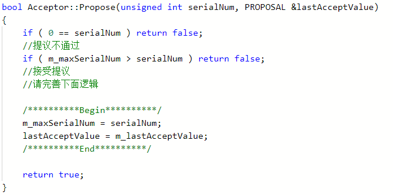
  - 阶段二：Accept阶段：
    - 对于Proposed(N)请求，Proposer会接收到Acceptor的响应：

      - 如果Acceptor的拒绝达到了半数以上，则增加提议号为K，再次发起一个新的对提案的Proposed(K)请求。

        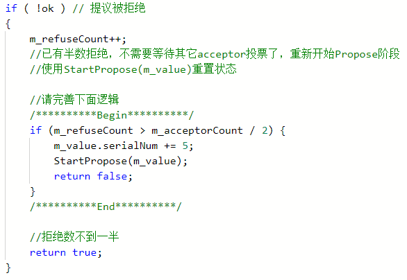

      - 如果客户端回复的提案号大于该Proposer内的提案号，则将本地提案更新为客户端回复的新提案，更新本地的maxN。

        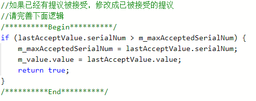

      - 如果Acceptor的接受达到了半数以上，则自己的提议被接受，可以提交提案。

        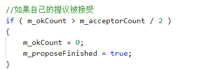

    - 只要Proposer收到半数以上Acceptor对其Propose(N)请求的响应，那么它就会发送一个针对提案N的Accept请求给半数以上的Acceptor，进入Accept阶段，记为Accept(N)请求。

      - Acceptor接受到Accept(N)请求后，如果maxN > N，则拒绝，否则接受并更新maxN和lastAcceptPropose。

        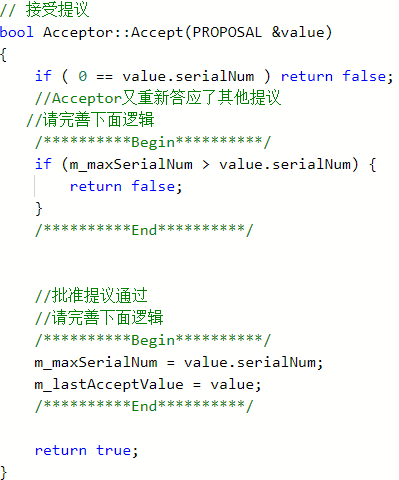

      - 如果Proposer接收到半数以上的确认，则可以将结果通知给所有的learner。

      - 如果Proposer接收到半数以上的拒绝，则增加提议号为K，再次发起一个对提案的Proposed(K)请求。

        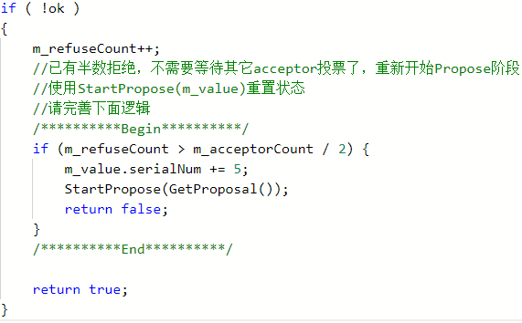

### 实验结果

#### 结果截图

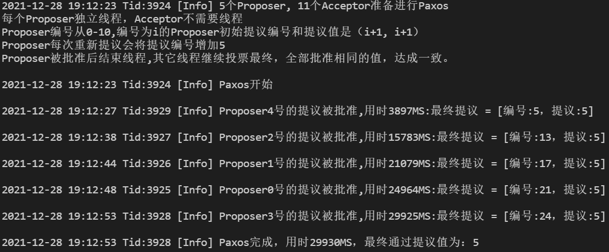

#### 结果分析

## Lab2 使用MapReduce实现倒排索引

### 实验目的

理解MapReduce算法。

### 实验内容

编写 MapReduce 实现倒排索引。

- MapReduce基本概念

  

  - map函数：将读取到的文件内容映射为键值对，形如<key, value>
  - combine函数：将上一步map函数中相同key值的value聚合起来，减少reduce阶段的数据传输量
  - reduce函数：将上一步所有combine函数中相同key值的value进一步聚合起来，形成最终结果

- 倒排索引：将file到word&counts的索引转换为words到file&counts的倒排索引

  - file到word&nums的索引

    

  - 倒排索引

    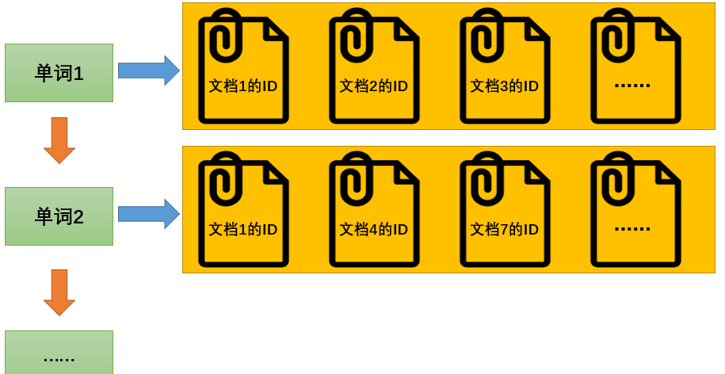

- 使用mapreduce实现倒排索引实验中，默认输入目录下面有三个文件：
  - file1.txt  //内容：mapreduce is simple
  - file2.txt  //内容：mapreduce is powerful and simple
  - file3.txt  //内容：mapreduce and mapreduce

  期待倒排后的输出文件内容为：

  - and file3.txt:1;file2.txt:1;
  - is file2.txt:1;file1.txt:1;
  - mapreduce file1.txt:1;file2.txt:1;file3.txt:2;
  - powerful file2.txt:1;
  - simple file2.txt:1;file1.txt:1;

  我们用上述输出第一行来进行解释: 单词 ’and’ 在 file3.txt 中出现1 次， 在file2.txt中出现1次

### 实验方法

#### main函数

首先在main函数注册Map类，Combine类和Reduce类，并设置它们的输出类型。

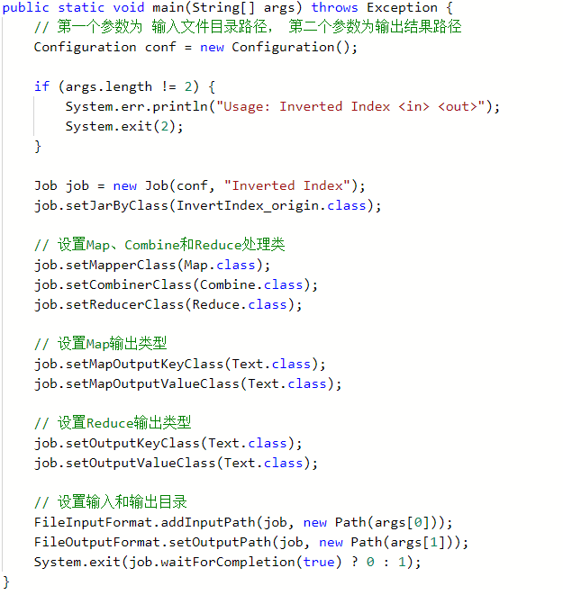

#### Map函数

- 将文件中的单词和对应文件名使用:号连接，作为key值，所有key值的value初始化为1。文件名通过API获取。

  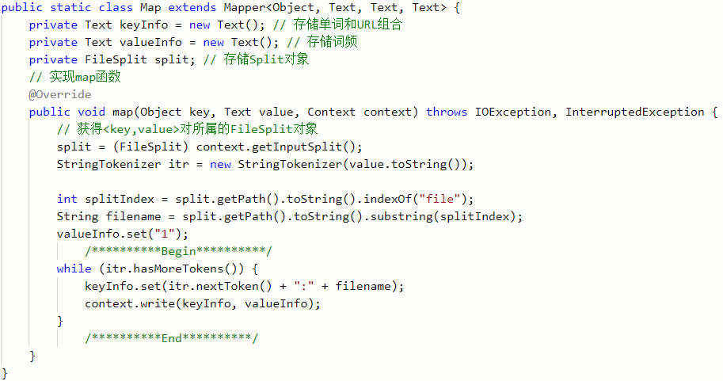

#### Combine函数

- 将map函数输出结果中的键值对中相同的key值的value相加
  - 形如 < mapreduce:file3.txt, 1> + < mapreduce:file3.txt, 1 > => < mapreduce:file3.txt, 2 >
  - 输出的key值为单词，value值为 文件名和单词出现次数，使用:连接。形如<mapreduce, file3.txt:2>

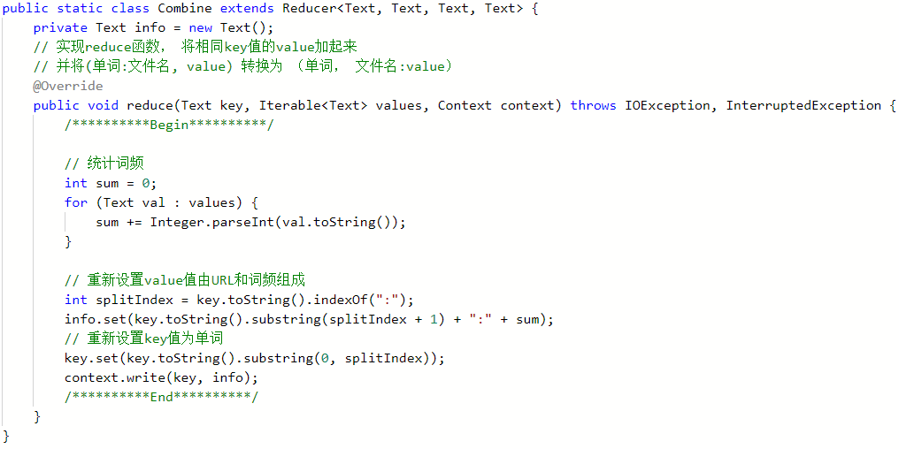

#### Reduce函数

- 将combine函数的输出结果中所有key值相同的value用`;` 连接起来。形如<and, file3.txt:1> + <and, file2.txt:1> => <and, file3.txt:1;file2.txt:1;>

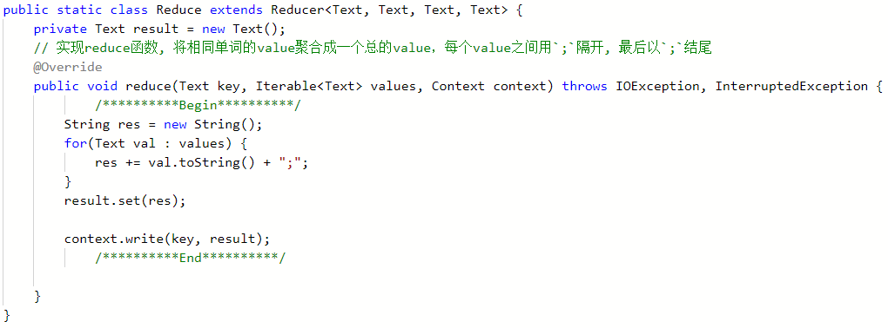

### 实验结果

#### 结果截图

## Lab3 分布式缓存一致性-写穿算法

### 实验目的

学习分布式文件系统的写穿算法，并使用Python模拟实现。

### 实验内容

补充模拟实现呢写穿算法。

#### 分布式文件系统

- 从用户的使用角度来看，分布式文件系统是一个标准的文件系统，提供了一系列API，由此进行文件或目录的创建、移动、删除，以及对文件的读写等操作
- 从内部实现角度来看，分布式文件系统还要通过网络管理存储在多个节点上的文件和目录。并且，同一文件不只是存储在一个节点上，而是按规则分布存储在一簇节点上，协同提供服务

#### 写穿算法

当用户在修改高速缓存项（文件或块）时，新的值保存在高速缓存中，并立即写回到服务器，当用户读取速缓存项（文件或块）时，需要先和服务端进行文件的version号比对，如果一致，直接从高速缓存项cache中读取文件，如果不一致则从服务器中读取文件并将文件缓存在本地高速cache中。

### 实验方法

根据代码中的提示可以比较容易地写出代码

#### Read过程

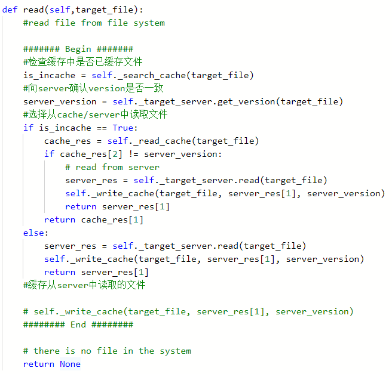

#### Write过程

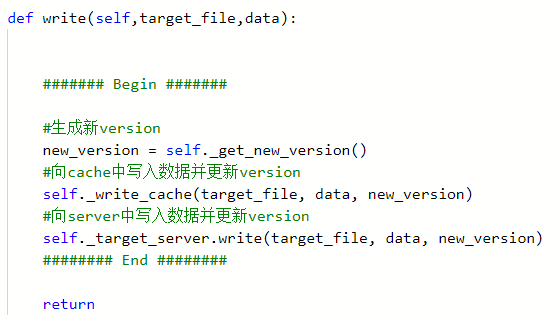

### 实验结果

#### 结果截图

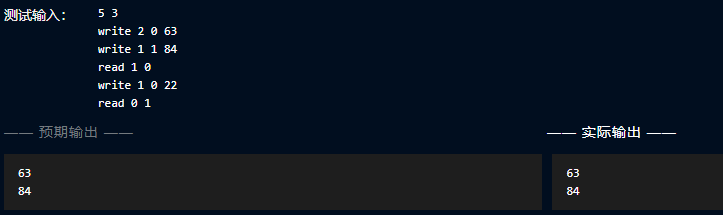

## 总结与收获

